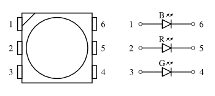

# SMD RGB LEDs

- bought from [Segor](http://www.segor.de/#Q%3DLED5252RGB%26M%3D1)
- no clear indication of a model, so no datasheet
- conducted our own measurement of forward voltages given a fixed forward current:

| Fwd current | Fwd voltage R | Fwd voltage G | Fwd voltage B |
|-------------|---------------|---------------|---------------|
|    20 mA    |     2.08 V    |     3.39 V    |     3.14 V    |
|    25 mA    |     2.12 V    |     3.45 V    |     3.21 V    |
|    30 mA    |     2.15 V    |     3.49 V    |     3.26 V    |

- every single one of the 3 LEDs inside that package can be controlled independently

